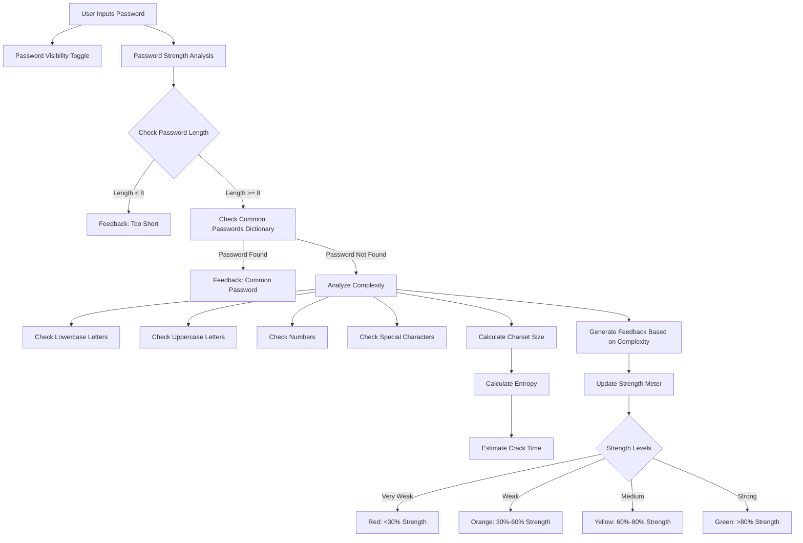
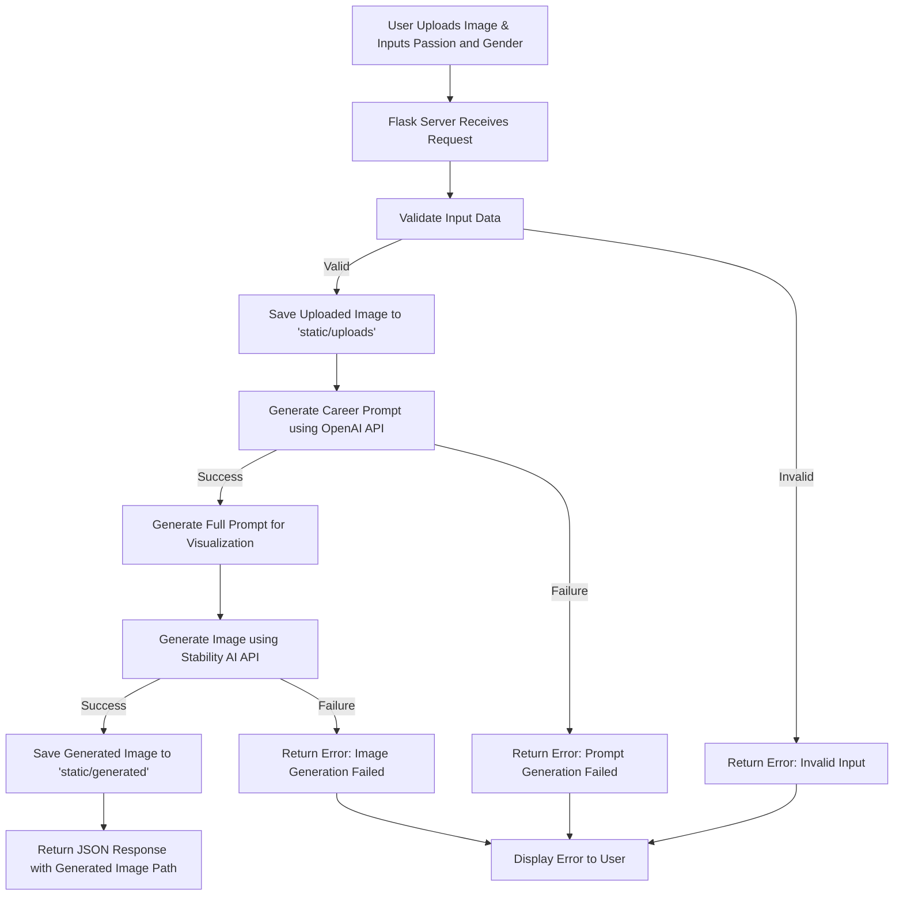
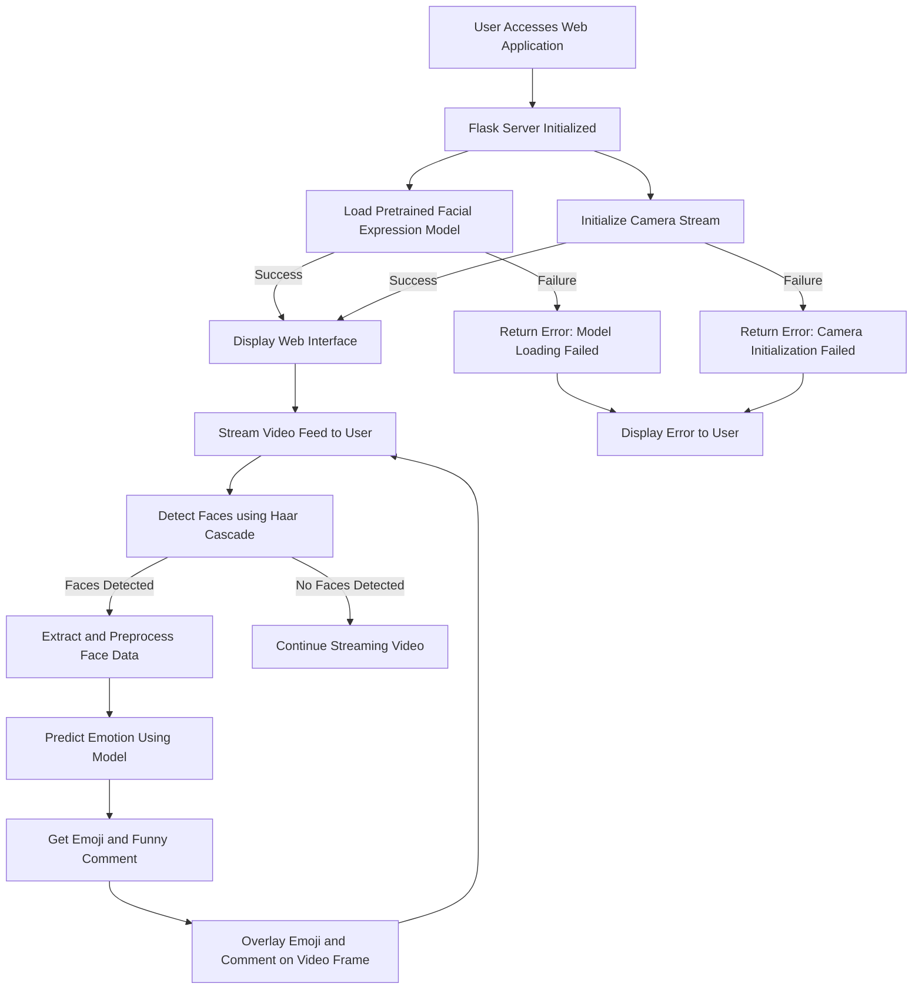
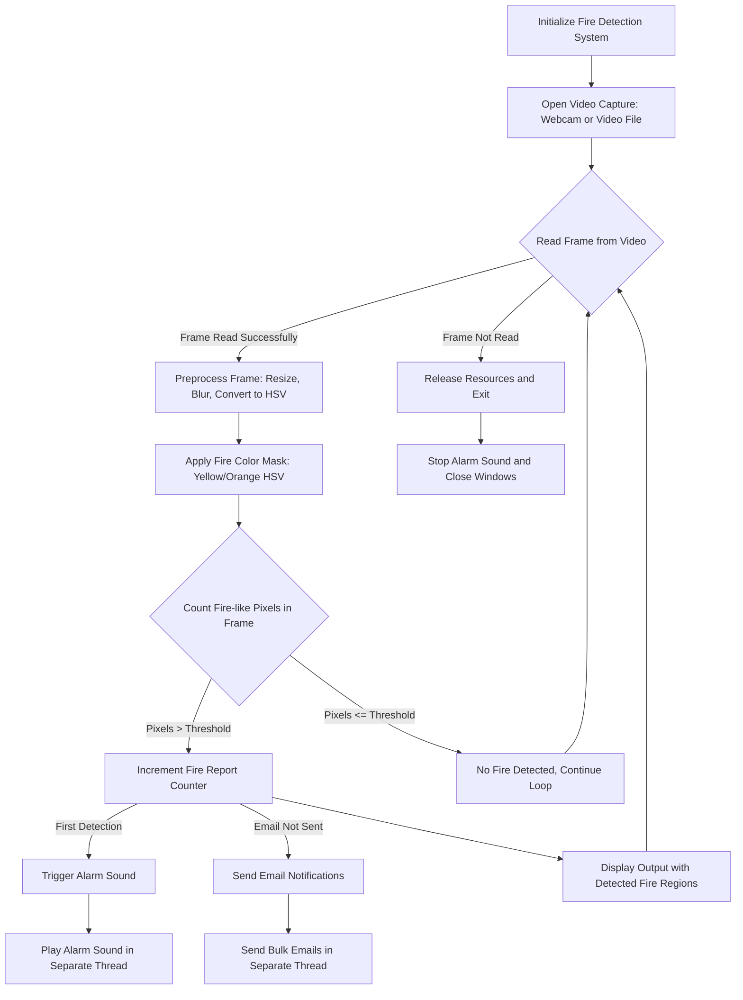

# Expo Projects

This repository contains multiple projects developed as part of the ISMT Expo. Each project focuses on solving real-world problems using technology.

---

## Projects

### 1. Face Expression Recognition System
**Description**:  
A machine learning-based system for recognizing facial expressions. It classifies emotions into predefined categories such as Anger, Disgust, Fear, Happy, Neutral, Sadness, and Surprise.

**Features**:
- Recognizes and classifies facial expressions.
- Uses deep learning models trained on labeled datasets.
- Integrated with templates for a user-friendly interface.

**Project Structure**:
- **Datasets**: Contains the training and testing datasets.
- **emojis**: Stores emoji images for representing detected emotions.
- **models**: Includes pre-trained deep learning models.
- **Notebook**: Contains Jupyter notebooks for model training and testing.
- **templates**: HTML templates for the frontend.
- `facial_expression_system.py`: Main Python file to run the system.

---

### 2. Fire Detection and Alarm System
**Description**:  
A smart fire detection system that identifies fire events in real-time and triggers an alarm.

**Features**:
- Detects fire using image processing techniques.
- Sends real-time alerts when fire is detected.
- Can be integrated with IoT devices for automation.

**Project Structure**:
- **Datasets**: Contains fire and non-fire images for training.
- **models**: Pre-trained fire detection models.
- **Notebook**: Jupyter notebooks for training and evaluation.
- `fire_detection_system.py`: Python script to execute the fire detection system.

---

### 3. Love Alchemy
**Description**:  
A playful application that predicts compatibility between individuals based on names and other inputs.

**Features**:
- Predicts compatibility percentage between two people.
- Provides fun and engaging feedback.
- Uses simple algorithms for computation.

**Project Structure**:
- **Datasets**: Stores related datasets.
- **models**: Contains models for analysis (if applicable).
- **Notebook**: Jupyter notebooks for any computations or experimentation.
- **templates**: HTML templates for the user interface.
- `love-alchemy.py`: Main script for running the application.

---

### 4. Password Strength Meter
**Description**:  
A web-based application to measure and visualize the strength of passwords.

**Features**:
- Evaluates password strength based on criteria like length, complexity, and uniqueness.
- Provides real-time feedback to users.
- Built using HTML, CSS, and JavaScript.

**Project Structure**:
- `password-strength-meter.html`: Main HTML file for the application.

---

## How to Run

1. Clone the repository:
   ```bash
   git clone https://github.com/siddhantbhattarai/Expo-Projects.git
   ```
2. Navigate to the project directory of your choice:
   ```bash
   cd ISMT-EXPO/Project-Name
   ```
3. Run the application:
   - For Python projects:
     ```bash
     python script-name.py
     ```
   - For the Password Strength Meter:
     Open the `password-strength-meter.html` file in your web browser.

---

## Requirements

- Python 3.x
- Jupyter Notebook
- Required Python libraries (install using `pip install -r requirements.txt`)

---

# System Diagrams

## Password Strength Meter


## Career Visualization Tool


## Facial Expression Detection System


## Fire Detection System


## Compatibility Predictor
```mermaid
graph TD
    A[User Accesses Compatibility Predictor Web App] --> B[Render Home Page]
    B --> C[User Submits Compatibility Form]
    C --> D[Extract Input Data from Form]
    D --> E[Preprocess Input Data for Model]
    E --> F[One-Hot Encode Input Data]
    F --> G[Align Input Data with Training Columns]
    G --> H[Convert Data to Numpy Array]
    H --> I[Load Pretrained Random Forest Model]
    I --> J[Predict Compatibility Probability]
    J --> K[Calculate Compatibility Percentage]
    K --> L[Generate Funny Comment Based on Compatibility]
    L --> M[Render Result in Web Template]
